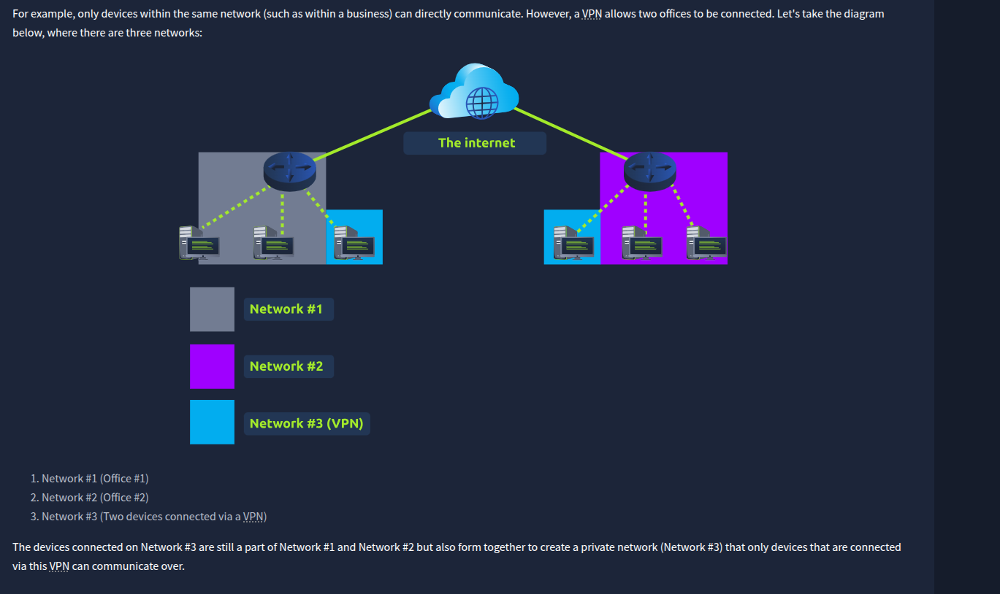

### Introduction to Port Forwarding

- Port forwarding is an essential component in connecting applications and services to the Internet. Without port forwarding, applications and services such as web servers are only available to devices within the same direct network.
- 
- If the administrator wanted the website to be accessible to the public (using the Internet), they would have to implement port forwarding, like in the diagram below:
- 
- port forwarding is configured at the router of a network

### Firewalls 101

- **firewall** is a device within a network responsible for determining what traffic is allowed to enter and exit
- it can **permit** and **deny** traffic from entering or exiting based on factors:
  - Where the traffic is coming from? (has the firewall been told to accept/deny traffic from a specific network?)
  - Where is the traffic going to? (has the firewall been told to accept/deny traffic destined for a specific network?)
  - What port is the traffic for? (has the firewall been told to accept/deny traffic destined for port 80 only?)
  - What protocol is the traffic using? (has the firewall been told to accept/deny traffic that is UDP, TCP or both?)

- can be a device of software (i.e.g _Snort_)
  - 

Categories of Firewalls

|     |     |
| --- | --- |
| **Firewall Category** | **Description** |
| Stateful | This type of firewall uses the entire information from a connection; rather than inspecting an individual packet, this firewall determines the behaviour of a device **based upon the entire connection**.  This firewall type consumes many resources in comparison to stateless firewalls as the decision making is dynamic. For example, a firewall could allow the first parts of a TCP handshake that would later fail.  If a connection from a host is bad, it will block the entire device. |
| Stateless | This firewall type uses a static set of rules to determine whether or not **individual packets** are acceptable or not. For example, a device sending a bad packet will not necessarily mean that the entire device is then blocked.  Whilst these fire654321walls use much fewer resources than alternatives, they are much dumber. For example, these firewalls are only effective as the rules that are defined within them. If a rule is not exactly matched, it is effectively useless.  However, these firewalls are great when receiving large amounts of traffic from a set of hosts (such as a Distributed Denial-of-Service attack) |

### VPN Basics

- A **V**irtual **P**rivate **N**etwork (or **VPN** for short) is a technology that allows devices on separate networks to communicate securely by creating a dedicated path between each other over the Internet (known as a tunnel). Devices connected within this tunnel form their own private network.

 

|     |     |
| --- | --- |
| **Benefit** | **Description** |
| Allows networks in different geographical locations to be connected. | For example, a business with multiple offices will find VPNs beneficial, as it means that resources like servers/infrastructure can be accessed from another office. |
| Offers privacy. | VPN technology uses encryption to protect data. This means that it can only be understood between the devices it was being sent from and is destined for, meaning the data isn't vulnerable to sniffing.  This encryption is useful in places with public WiFi, where no encryption is provided by the network. You can use a VPN to protect your traffic from being viewed by other people. |
| Offers anonymity. | Journalists and activists depend upon VPNs to safely report on global issues in countries where freedom of speech is controlled.  Usually, your traffic can be viewed by your ISP and other intermediaries and, therefore, tracked.   The level of anonymity a VPN provides is only as much as how other devices on the network respect privacy. For example, a VPN that logs all of your data/history is essentially the same as not using a VPN in this regard. |

- improvements in VPN technology

|     |     |
| --- | --- |
| **VPN Technology** | **Description** |
| PPP | This technology is used by PPTP (explained below) to allow for authentication and provide encryption of data. VPNs work by using a private key and public certificate (similar to **SSH**). A private key & certificate must match for you to connect.  This technology is not capable of leaving a network by itself (non-routable). |
| PPTP | The **P**oint-to-**P**oint **T**unneling **P**rotocol (**PPTP**) is the technology that allows the data from PPP to travel and leave a network.   PPTP is very easy to set up and is supported by most devices. It is, however, weakly encrypted in comparison to alternatives. |
| IPSec | Internet Protocol Security (IPsec) encrypts data using the existing **I**nternet **P**rotocol (**IP**) framework.  IPSec is difficult to set up in comparison to alternatives; however, if successful, it boasts strong encryption and is also supported on many devices. |
