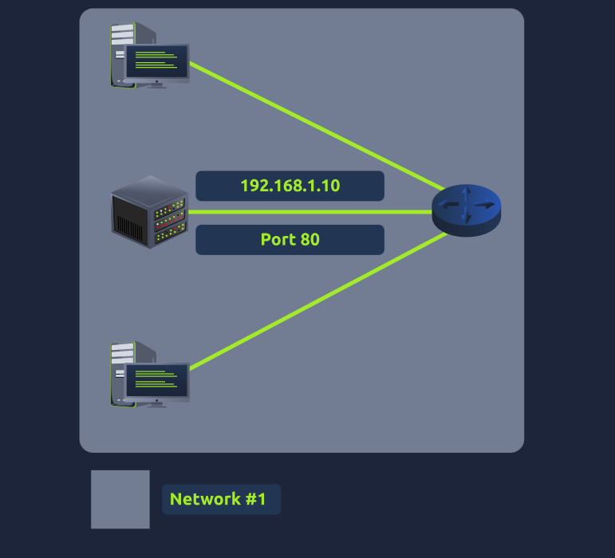
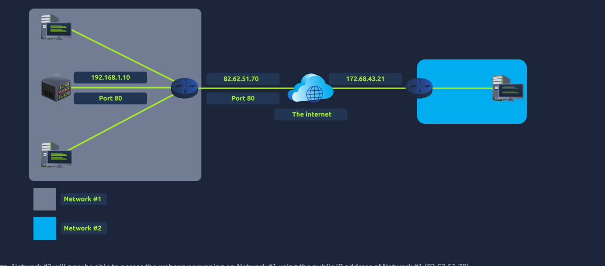

### Introduction to Port Forwarding

- Port forwarding is an essential component in connecting applications and services to the Internet. Without port forwarding, applications and services such as web servers are only available to devices within the same direct network.
- 
- If the administrator wanted the website to be accessible to the public (using the Internet), they would have to implement port forwarding, like in the diagram below:
- 
- port forwarding is configured at the router of a network

### Firewalls 101

- **firewall** is a device within a network responsible for determining what traffic is allowed to enter and exit
- it can **permit** and **deny** traffic from entering or exiting based on factors:
  - Where the traffic is coming from? (has the firewall been told to accept/deny traffic from a specific network?)
  - Where is the traffic going to? (has the firewall been told to accept/deny traffic destined for a specific network?)
  - What port is the traffic for? (has the firewall been told to accept/deny traffic destined for port 80 only?)
  - What protocol is the traffic using? (has the firewall been told to accept/deny traffic that is UDP, TCP or both?)

- can be a device of software (i.e.g _Snort_)
  - 
- 