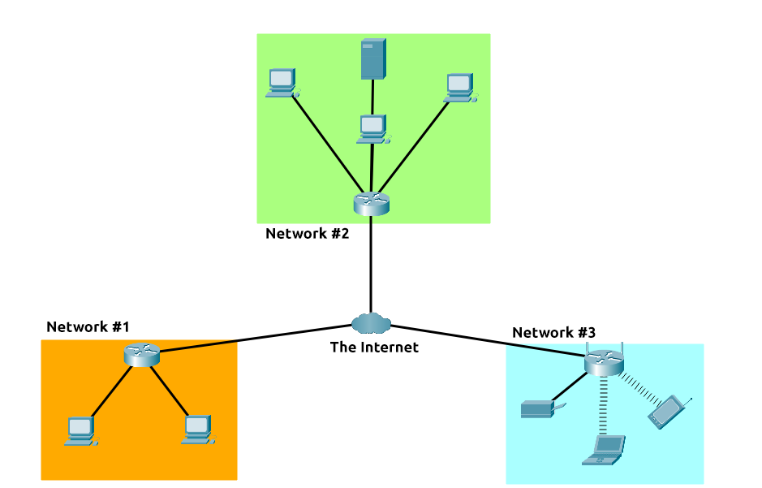

### What is a network?
 

 

how will Bob and Jim speak to Zayn and Toby?

- first iteration of the Internet was within the ARPANET project in the late 1960s. This project was funded by the United States Defence Department and was the first documented network in action. However, it wasn't until 1989 when the Internet as we know it was invented by Tim Berners-Lee by the creation of the **W**orld **W**ide **W**eb (**WWW**)
- 
- made up of many small networks all joined together.  These small networks are called private networks, where networks connecting these small networks are called public networks -- or the Internet!
- 
  - a private network
  - a public network
- devices must be both identifying and identifiable on a network (e.g. name and fingerprints)
- fingerprint = media access control (MAC) address
- address = ip address

 

- divided into 4 octets
- value of octets summarise to be IP address of device on the network
  - IP addressing & subnetting
  - cannot be active simultaneously in same network
-  