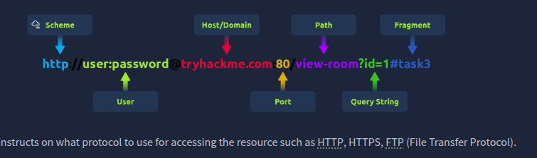
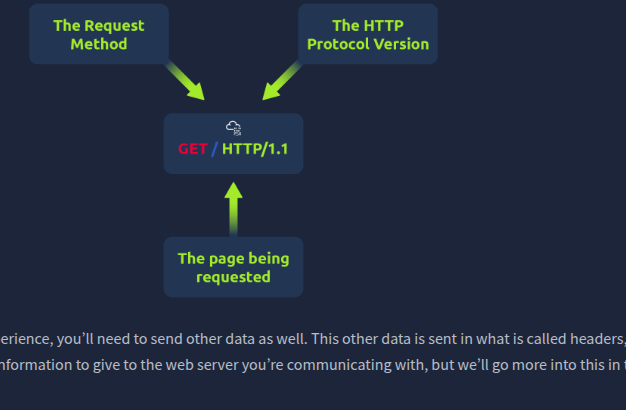
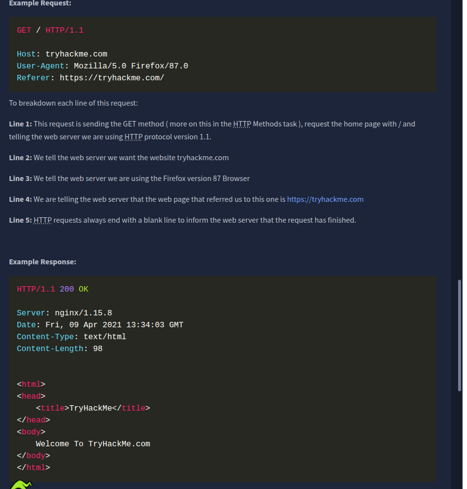

### What is HTTP? (HyperText Transfer Protocol)

**What is HTTP? (HyperText Transfer Protocol)**

HTTP is what's used whenever you view a website, developed by Tim Berners-Lee and his team between 1989-1991. HTTP is the set of rules used for communicating with web servers for the transmitting of webpage data, whether that is HTML, Images, Videos, etc.

**What is HTTPS?** ****(HyperText Transfer Protocol Secure)****

HTTPS is the secure version of HTTP. HTTPS data is encrypted so it not only stops people from seeing the data you are receiving and sending, but it also gives you assurances that you're talking to the correct web server and not something impersonating it.

### Requests and Responses

- what url looks like with all its features (not all are used)
- 
- **Scheme:** This instructs on what protocol to use for accessing the resource such as HTTP, HTTPS, FTP (File Transfer Protocol).

**User:** Some services require authentication to log in, you can put a username and password into the URL to log in.

**Host:** The domain name or IP address of the server you wish to access.

**Port:** The Port that you are going to connect to, usually 80 for HTTP and 443 for HTTPS, but this can be hosted on any port between 1 - 65535.

**Path:** The file name or location of the resource you are trying to access.

**Query String:** Extra bits of information that can be sent to the requested path. For example, /blog?**id=1** would tell the blog path that you wish to receive the blog article with the id of 1.

**Fragment:** This is a reference to a location on the actual page requested. This is commonly used for pages with long content and can have a certain part of the page directly linked to it, so it is viewable to the user as soon as they access the page.

**Making a Request**

It's possible to make a request to a web server with just one line **GET / HTTP/1.1**

 

 

### HTTP Methods

HTTP methods are a way for the client to show their intended action when making an HTTP request. There are a lot of HTTP methods but we'll cover the most common ones, although mostly you'll deal with the GET and POST method.

**GET Request**

This is used for getting information from a web server.  

**POST Request**

This is used for submitting data to the web server and potentially creating new records  

**PUT Request**

This is used for submitting data to a web server to update information

**DELETE Request**  

This is used for deleting information/records from a web server.