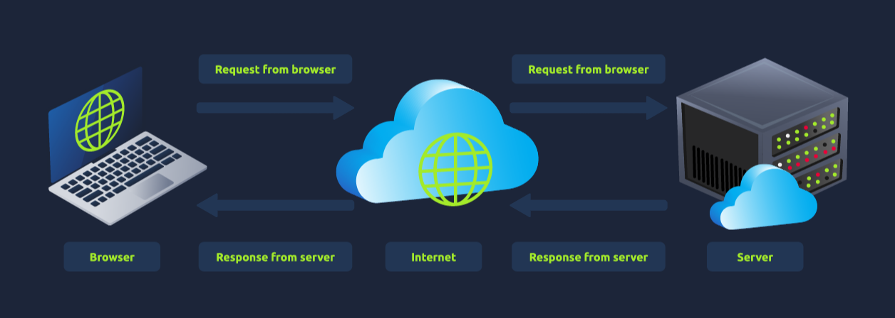
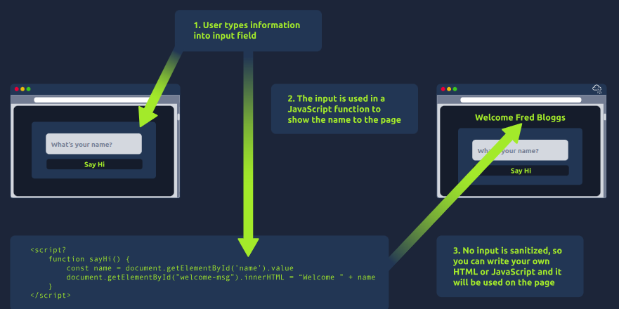

### How websites work

- makes a request to a web server asking for information about the page you're visiting. It will respond with data that your browser uses to show you the page; a web server is just a dedicated computer somewhere else in the world that handles your requests
- 
- There are two major components that make up a website:

  1.  Front End (Client-Side) - the way your browser renders a website.
  2.  Back End (Server-Side) - a server that processes your request and returns a response.

### HTML

- HTML, to build websites and define their structure
- CSS, to make websites look pretty by adding styling options
- JavaScript, implement complex features on pages using interactivity

### JavaScript

- ``
- The following JavaScript code finds a HTML element on the page with the id of "demo" and changes the element's contents to "Hack the Planet" : `document.getElementById("demo").innerHTML = "Hack the Planet";`
-  The following code changes the text of the element with the demo ID to Button Clicked: `<button onclick='document.getElementById("demo").innerHTML = "Button Clicked";'>Click Me!</button>` - onclick events can also be defined inside the JavaScript script tags, and not on elements directly.

### Sensitive Data Exposure

- when a website doesn't properly protect (or remove) sensitive clear-text information to the end-user; usually found in a site's frontend source code

### HTML Injection

- when unfiltered user input is displayed on the page
- sanitisation is very important in keeping a website secure, as information a user inputs into a website is often used in other frontend and backend functionality. A vulnerability you'll explore in another lab is database injection
- When a user has control of how their input is displayed, they can submit HTML (or JavaScript) code, and the browser will use it on the page, allowing the user to control the page's appearance and functionality.
-  