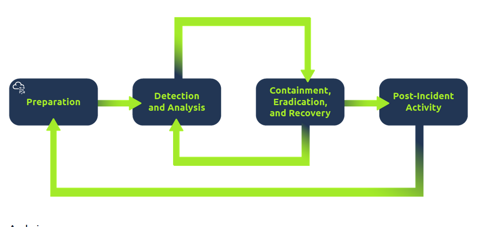

- A virus is a piece of code (part of a program) that attaches itself 
  to a program. It is designed to spread from one computer to another and 
  works by altering, overwriting, and deleting files once it infects a 
  computer. The result ranges from the computer becoming slow to unusable.
- Trojan Horse is a program that shows one desirable function but 
  hides a malicious function underneath. For example, a victim might 
  download a video player from a shady website that gives the attacker 
  complete control over their system.
- Ransomware is a malicious program that encrypts the user’s files. 
  Encryption makes the files unreadable without knowing the encryption 
  password. The attacker offers the user the encryption password if the 
  user is willing to pay a “ransom.”

 *Security Operations Center* (SOC) analyst responsible for protecting a bank. This bank's SOC uses a *Security Information and Event Management* (SIEM) tool, which gathers security-related information and events from various sources and presents them in one dashboard. If the SIEM finds something suspicious, an alert will be generated.
