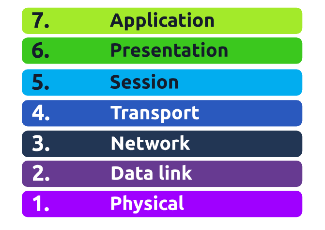
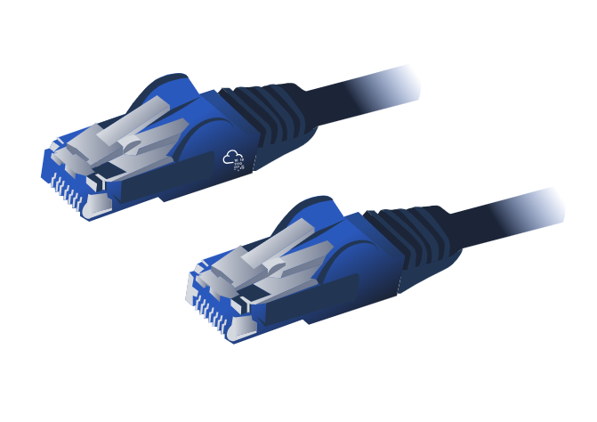
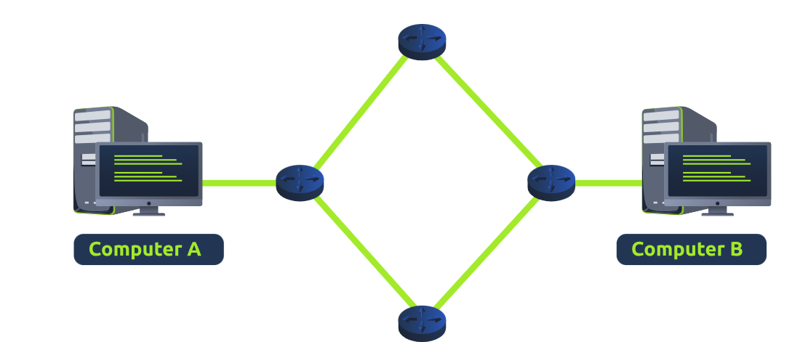

https://tryhackme.com/room/osimodelzi

## OSI Model

### What is the OSI Model?

- **OSI** model (or **O**pen **S**ystems **I**nterconnection Model) is an essential model used in networking.  This critical model provides a framework dictating how all networked devices will send, receive and interpret data
- different devices can still communicate
- **encapsulation** - every layer data travels through, , specific processes take place, and pieces of information are added to this data
- 

### Layer 1 - Physical

- references the physical components of the hardware used in networking and is the lowest layer that you will find
- devices use electrical signals to transfer data between each other in binary
- 

### Layer 2 - Data Link

- physical addressing of transmission
- receives a packet from network layer (including IP address on remote computer) and adds physical **MAC** address to the receiving endpoint
- every network-enabled computer has a **Network Interface Card (NIC)** -- comes with a unique MAC to identify
- MACs are set by the manufacturer and burnt into the card -- can't be changed (BUT CAN BE SPOOFED)
- job of this layer to present the data in a format suitable for transmission

### Layer 3 - Network

- where the magic of routing & re-assembly of data takes place (from these small chunks to the larger chunk)
- routing determines the most optimal path in which these chunks of data should be sent
- some protocols at this layer determine exactly what is the "optimal" path that data should take to reach a device, we should only know about their existence at this stage of the networking module. Briefly, these protocols include **OSPF** (**O**pen **S**hortest **P**ath **F**irst) and **RIP** (**R**outing **I**nformation **P**rotocol).
  -   What path is the **shortest**? I.e. has the **least amount of devices** that the packet needs to travel across.
  -   What path is the most **reliable**? I.e. have packets been lost on that path before?
  -   Which path has the **faster** physical connection? I.e. is one path using a **copper connection** (slower) or a **fibre** (considerably faster)?
  -   everything dealt with using IP addresses -- known as Layer 3 devices

 

### Layer 4 - Transport

- when data sent between devices, 2 protocols
- **T**ransmission **C**ontrol **P**rotocol (**TCP**)
  - designed with reliability and guarantee in mind
  - reserves constant connection between two devices for the amount of time it takes for the data to be sent and received
  - incorporates error-checking to guarantee data been sent and received
  
|     |     |
| --- | --- |
| **Advantages of TCP** | **Disadvantages of TCP   ** |
| Guarantees the accuracy of data. | Requires a reliable connection between the two devices. If one small chunk of data is not received, then the entire chunk of data cannot be used. |
| Capable of synchronising two devices to prevent each other from being flooded with data. | A slow connection can bottleneck another device as the connection will be reserved on the receiving computer the whole time. |
| Performs a lot more processes for reliability. | TCP is significantly slower than UDP because more work has to be done by the devices using this protocol. |

