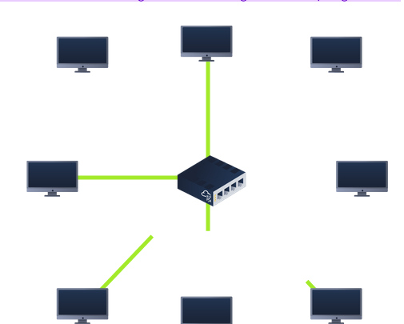
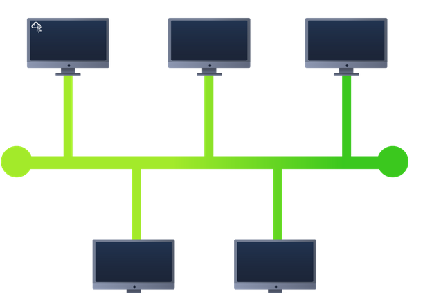
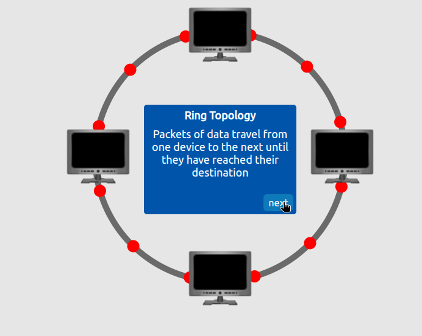
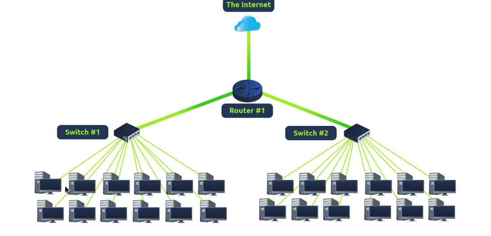
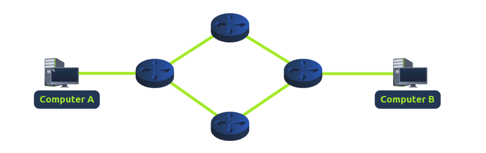
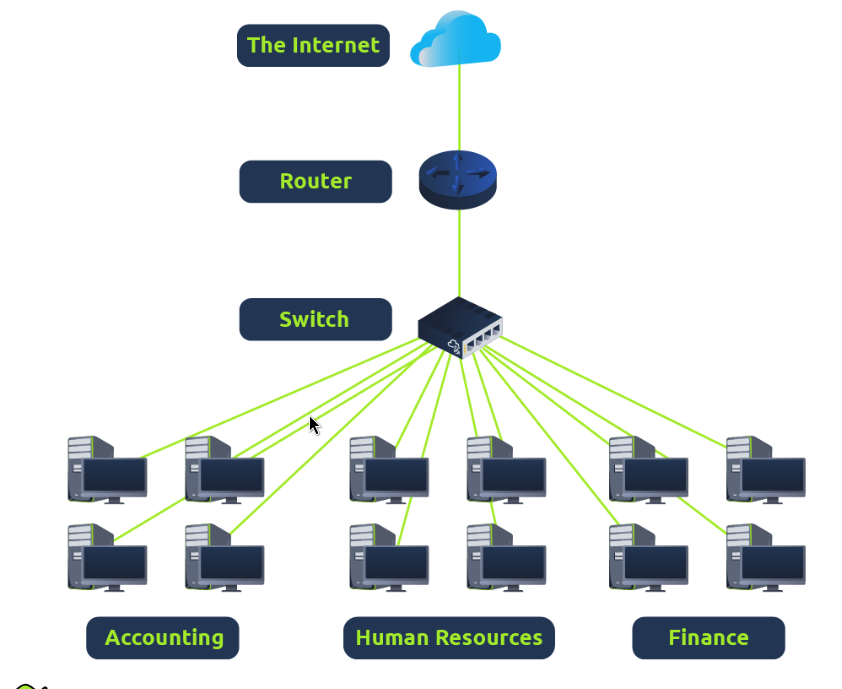
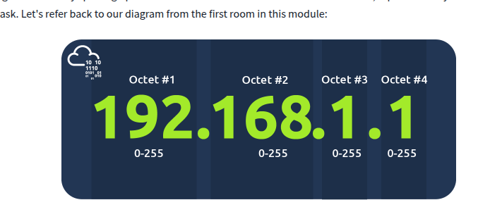
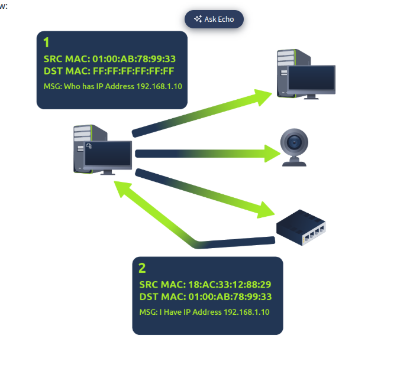

### Local Area Network (LAN) Topologies

- "topology", we are actually referring to the design or look of the network at hand. Let's discuss the advantages and disadvantages of these topologies below.
- 

#### Star Topology 

- devices are individually connected via a central networking device known as a _switch_ or _hub_
- information sent to a device is sent via the central device
- more expensive than any other topology, but more scalable
- more it scales, more maintenance is required
- prone to failure, albeit reduced
- if central device fails, nothing will be sent!
- switches don't usually die often, and when they do you can get a better newer one
- _**most common**_

#### Bus Topology

- relies on single connection known as _backbone cable_
- "leaf off a tree"
- because on cable, prone to slow and bottlenecked if devices are all simultaneously requesting data
- difficult troubleshooting to identify which device is experiencing issues
- easier and cost-efficient/ cabling and network equipment
- little redundancy -- single point of failure on backbone cable
- 

#### Ring Topology

 

-  ring topology (also known as token topology)
-  Devices such as computers are connected directly to each other to form a loop, meaning that there is little cabling required and less dependence on dedicated hardware such as within a star topology
-  Interestingly, a device will only send received data from another device in this topology if it does not have any to send itself. If the device happens to have data to send, it will send its own data first before sending data from another device.
- traveling in only one direction, fairly easy to troubleshoot any faults
- but has to visit multiple devices first before reaching intended
- less prone to bottlenecks, unlike bus topology; a fault like a cable cut will result in network breaking
- _**less common**_

### What is a Switch?

- switch - dedicated devices within a network that are designed to aggregate multiple other devices such as computers, printers, or any other networking-capable device using ethernet
- devices plug into switch ports
- usually found in larger networks (businesses, schools, etc)
- ports of 4,8,16...64
- keep track of what devices is connected to which port
  - this is _unlike a hub_ which will send the same packed to every port
  - reduced network traffic
- easier to break something into packets (like moving smaller boxes)

 

### What is a Router?

- a router's job to connect networks and pass data between them. It does this by using routing (hence the name router!).
- _routing_ is the process of data travelling across networks; creating a path between networks so that this data can be successfully delivered

 

### A Primer on Subnetting

- _**subnetting**_ splitting up a network into smaller, miniature networks within itself
- slicing cake up with friends, everyone gets a piece
- business example:
- 

- network admins use subnetting to categorise specific parts of a network to reflect this
- splitting number of hosts that can fit in network, represented by subnet mask

 

- an IP address is made up of four sections called octets. The same goes for a subnet mask which is also represented as a number of four bytes (32 bits), ranging from 0 to 255 (0-255).
  
Subnets use IP addresses in three different ways:

-   Identify the network address
-   Identify the host address
-   Identify the default gateway

|     |     |     |     |
| --- | --- | --- | --- |
| **Type** | **Purpose** | **Explanation** | **Example** |
| Network Address | This address identifies the start of the actual network and is used to identify a network's existence. | For example, a device with the IP address of 192.168.1.100 will be on the network identified by 192.168.1.0 | 192.168.1.0 |
| Host Address | An IP address here is used to identify a device on the subnet | For example, a device will have the network address of 192.168.1.1 | 192.168.1.100 |
| Default Gateway | The default gateway address is a special address assigned to a device on the network that is capable of sending information to another network | Any data that needs to go to a device that isn't on the same network (i.e. isn't on 192.168.1.0) will be sent to this device. These devices can use any host address but usually use either the first or last host address in a network (.1 or .254) | 192.168.1.254 |

Now, in small networks such as at home, you will be on one subnet as there is an unlikely chance that you need more than 254 devices connected at one time.

However, places such as businesses and offices will have much more of these devices (PCs, printers, cameras and sensors), where subnetting takes place.

Subnetting provides a range of benefits, including:

-   Efficiency
-   Security
-   Full control

### ARP

- Recalling from our previous tasks that devices can have two identifiers: A MAC address and an IP address, the **A**ddress **R**esolution **P**rotocol or **ARP** for short, is the technology that is responsible for allowing devices to identify themselves on a network.
- Address Resolution Protocol (ARP) is responsible for finding the MAC (hardware) address related to a specific IP address. It works by broadcasting an ARP query, "Who has this IP address? Tell me." And the response is of the form, "The IP address is at this MAC address."
- , ARP allows a device to associate its MAC address with an IP address on the network. Each device on a network will keep a log of the MAC addresses associated with other devices.

  #### How does ARP work?

- device within a network has a ledger to store information on, which is called a cache. In the context of ARP, this cache stores the identifiers of other devices on the network

In order to map these two identifiers together (IP address and MAC address), ARP sends two types of messages:

1.  **ARP Request**
2.  **ARP Reply**

When an **ARP request** is sent, a message is broadcasted on the network to other devices asking, "What is the mac address that owns this IP address?" When the other devices receive that message, they will only respond if they own that IP address and will send an **ARP reply** with its MAC address. The requesting device can now remember this mapping and store it in its **ARP cache** for future use.

 

