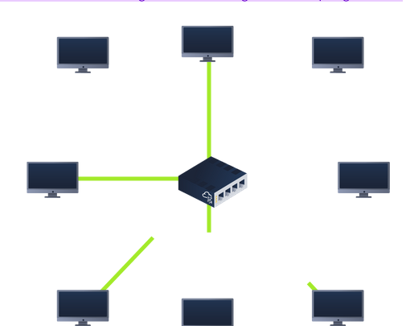

### Local Area Network (LAN) Topologies

- "topology", we are actually referring to the design or look of the network at hand. Let's discuss the advantages and disadvantages of these topologies below.
- 

#### Star Topology 

- devices are individually connected via a central networking device known as a _switch_ or _hub_
- information sent to a device is sent via the central device
- more expensive than any other topology, but more scalable
- more it scales, more maintenance is required
- prone to failure, albeit reduced
- if central device fails, nothing will be sent!

#### Bus Topology

