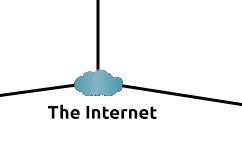
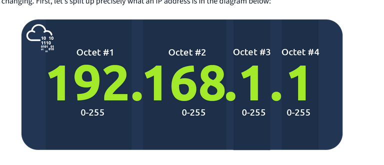

### What is a network?
 

 

how will Bob and Jim speak to Zayn and Toby?

- first iteration of the Internet was within the ARPANET project in the late 1960s. This project was funded by the United States Defence Department and was the first documented network in action. However, it wasn't until 1989 when the Internet as we know it was invented by Tim Berners-Lee by the creation of the **W**orld **W**ide **W**eb (**WWW**)
- 
- made up of many small networks all joined together.  These small networks are called private networks, where networks connecting these small networks are called public networks -- or the Internet!
- 
  - a private network
  - a public network
- devices must be both identifying and identifiable on a network (e.g. name and fingerprints)
- fingerprint = media access control (MAC) address
- address = ip address

 

- divided into 4 octets
- value of octets summarise to be IP address of device on the network
  ### IP addressing & subnetting
  - cannot be active simultaneously in same network
- 
- 
- public address is used to identify the device on the Internet, whereas a private address is used to identify a device amongst other devices
- public IP address is from ISP!
- 
- Cisco estimates 50 billion IP addresses in the world by end of 2021
- IPv6 is a new iteration of the Internet Protocol addressing scheme to help tackle this issue. Although it is seemingly more daunting, it boasts a few benefits:

-   Supports up to 2^128 of IP addresses (340 trillion-plus), resolving the issues faced with IPv4
-   More efficient due to new methodologies


### MAC Addresses

- network interface is assigned a unique address at the factory it was built at, called a **MAC** (**M**edia **A**ccess **C**ontrol ) address
- MAC address is a **twelve-character** hexadecimal number (_a base sixteen numbering system used in computing to represent numbers_) split into two's and separated by a colon.
- 
- can be spoofed
  - a firewall (security tool, hardware or software that is used to filter network traffic by stopping unauthorized incoming and outgoing traffic.) that's configured for admin MAC address could be tricked if it's spoofed
 
### Ping (ICMP)

- Ping uses **ICMP** (**I**nternet **C**ontrol **M**essage **P**rotocol) packets to determine the performance of a connection between devices, for example, if the connection exists or is reliable.
- 
Pings can be performed against devices on a network, such as your home network or resources like websites. This tool can be easily used and comes installed on Operating Systems (OSs) such as Linux and Windows. The syntax to do a simple ping is `ping IP address or website URL`. Let's see this in action in the screenshot below.

 

 

```bash
ping -c 4 google.com
```

This sends exactly 4 ICMP echo request packets, then stops and shows a summary

